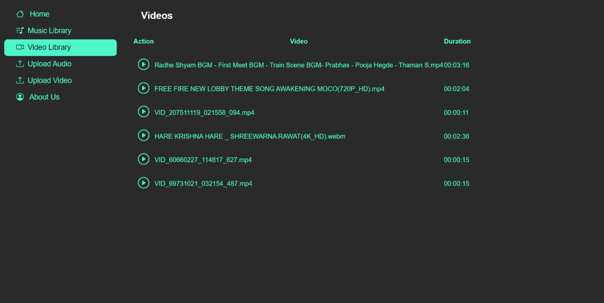

# Media Player

This is a simple **Media Player** project built using PHP, JavaScript, Bootstrap Icons, and some PHP libraries. Users can upload audio and video files to the server, and the title and media metadata will be saved in a database. Users can easily play the uploaded media files.


## Features

- Upload audio and video files to the server
- Save media metadata, including title, in a database
- Play uploaded media files easily

## Technologies Used

- PHP
- JavaScript
- Bootstrap Icons
- MySQL
- PHP libraries 

## Installation

1. Clone this repository to your local machine.
2. Set up a web server with PHP support.
3. Import the included database schema to create the necessary tables. The SQL file is available in the repository's assets folder (`assets/SQL/player.sql`).
   - You can import the SQL file using a database management tool like phpMyAdmin or by using the command-line interface. For example, using the command-line MySQL client:
     ```bash
     mysql -u your_username -p your_database_name < assets/SQL/player.sql
     ```
     Replace `your_username` with your MySQL username and `your_database_name` with the name of the database where you want to import the schema.
4. Update the database connection configuration in the PHP files, if needed.
5. Launch the application and start uploading and playing media files.

Feel free to customize and enhance the project according to your specific requirements.

## Screenshots





## License

This project is open source and available under the [MIT License](https://opensource.org/licenses/MIT).

Feel free to modify and enhance the project according to your needs.

